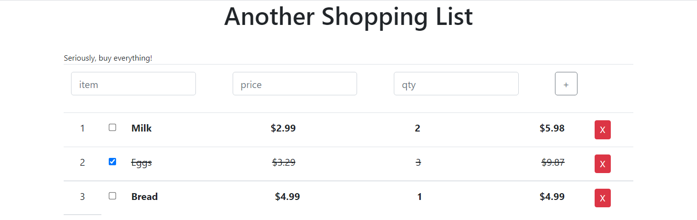

# Shopping List
This was an assignment for CIS3110 (Client-Side Development). We had to use React to create a todo-type list where items could be added, deleted, and marked complete.
I wanted to go the extra mile and add the ability to keep a running total of the list. I ended up just displaying the total for each row. I want to revisit this soon and add a running total at the bottom. 

...soon...

